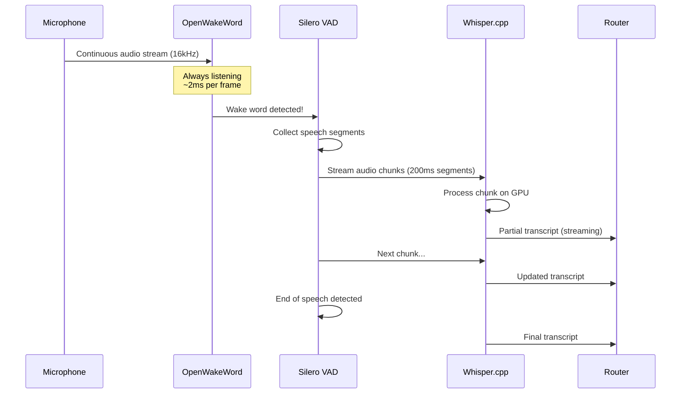
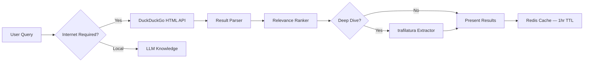
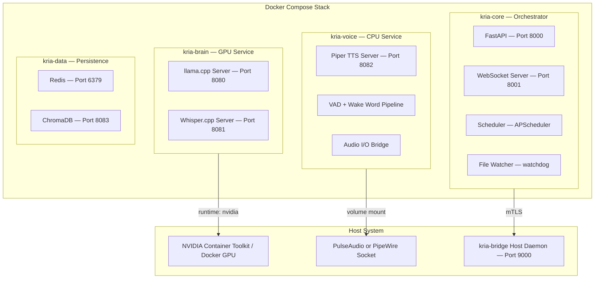
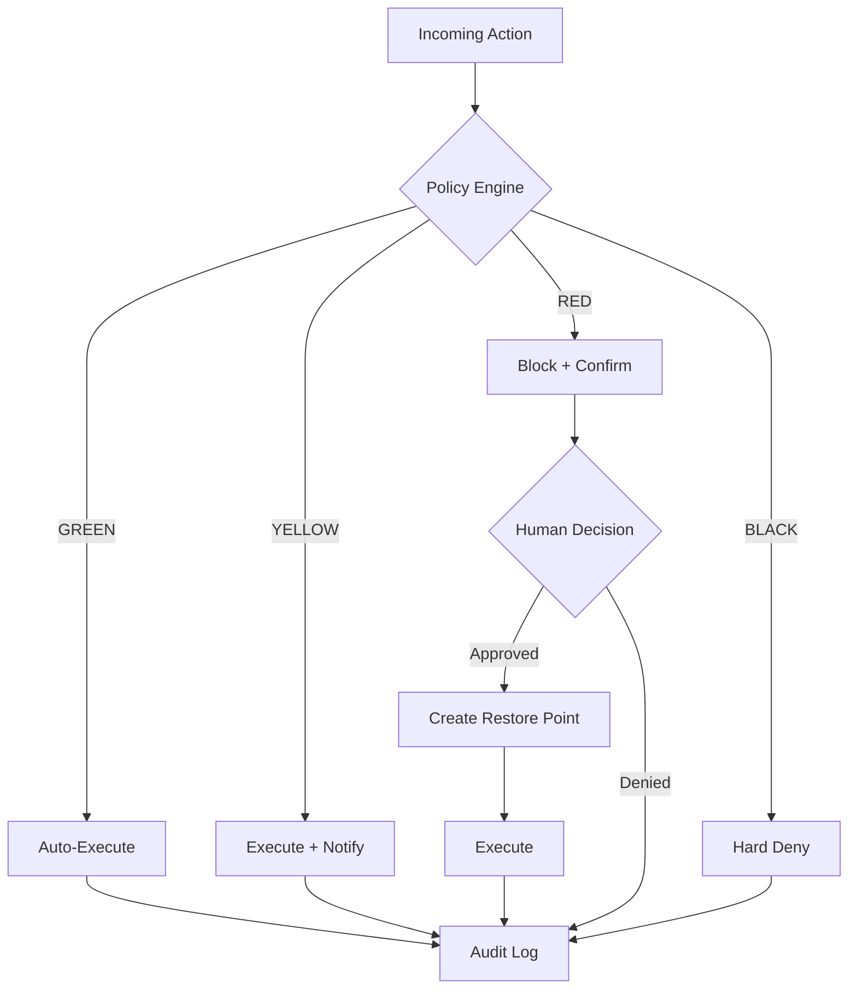

# K.R.I.A. — Kernel-Responsive Intelligent Agent

## Master System Design Document

| Field | Detail |
|---|---|
| **Project** | K.R.I.A. (Kernel-Responsive Intelligent Agent) |
| **Developer** | Obaidullah Zeeshan |
| **Academic Context** | BTech Computer Science — Final Year Project |
| **Document Version** | 2.0.0 |
| **Date** | April 2026 |
| **Target Hardware** | Acer Predator Helios Neo 16 — 16 GB RAM, NVIDIA RTX GPU |

---

## Table of Contents

1. [Executive Summary](#1-executive-summary)
2. [System Overview & Philosophy](#2-system-overview--philosophy)
3. [High-Level Architecture](#3-high-level-architecture)
4. [Module 1 — The Reasoning Brain](#4-module-1--the-reasoning-brain)
5. [Module 2 — The Sensory Pipeline](#5-module-2--the-sensory-pipeline)
6. [Module 3 — The Execution Layer](#6-module-3--the-execution-layer)
7. [Module 4 — Internet & Connectivity Layer](#7-module-4--internet--connectivity-layer)
8. [Module 5 — Advanced File Handling & Document Intelligence](#8-module-5--advanced-file-handling--document-intelligence)
9. [Module 6 — OS-Level Task Management](#9-module-6--os-level-task-management)
10. [Module 7 — Application Lifecycle Management](#10-module-7--application-lifecycle-management)
11. [Module 8 — Automation & Workflow Engine](#11-module-8--automation--workflow-engine)
12. [Module 9 — Notification & Communication Hub](#12-module-9--notification--communication-hub)
13. [Module 10 — Knowledge Base & Learning System](#13-module-10--knowledge-base--learning-system)
14. [Module 11 — Plugin & Extension Architecture](#14-module-11--plugin--extension-architecture)
15. [Module 12 — Hardware Optimization Strategy](#15-module-12--hardware-optimization-strategy)
16. [Module 13 — Deployment & Portability](#16-module-13--deployment--portability)
17. [Module 14 — Safety & Guardrail Logic](#17-module-14--safety--guardrail-logic)
18. [Technology Stack Summary](#18-technology-stack-summary)
19. [Latency Budget Breakdown](#19-latency-budget-breakdown)
20. [Future Roadmap](#20-future-roadmap)
21. [References](#21-references)

---

## 1. Executive Summary

K.R.I.A. is a locally-hosted, voice-controlled intelligent **AI Assistant** designed to be a complete operating system companion — not merely a chatbot, but a fully autonomous agent capable of:

- **Internet connectivity** — Web search, content extraction, real-time information, downloads, API consumption
- **Advanced file handling** — Document parsing (PDF, DOCX, XLSX, CSV, images), summarization, conversion, smart organization
- **OS-level task management** — Service control, scheduled tasks, environment configuration, system monitoring, disk management
- **Application lifecycle management** — Install, update, uninstall, launch, configure, and monitor applications
- **Workflow automation** — Event-driven triggers, scheduled routines, macro recording, chained multi-step workflows
- **Communication hub** — Desktop notifications, email drafting, clipboard intelligence, system alerts
- **Knowledge base** — Learning from user patterns, persistent preferences, contextual awareness, document RAG
- **Plugin architecture** — Third-party extensibility via a standardized plugin system

Unlike cloud-dependent assistants (Alexa, Siri, Google Assistant), K.R.I.A. runs entirely on-device, ensuring **zero data exfiltration**, **zero subscription costs**, and **sub-500ms voice-loop latency** for simple commands.

**Key Differentiators:**
- **Fully local** — no cloud dependency, no API keys, no telemetry for core operation
- **Internet-capable** — optional internet connectivity for web search, downloads, and real-time data (user-controlled)
- **Agentic** — can plan multi-step tasks, execute code, interact with the OS, browse the web autonomously
- **Safe** — four-tier risk classification with human-in-the-loop approval for dangerous operations
- **Portable** — Docker-based, reproducible on any NVIDIA-equipped Linux/WSL2 machine
- **Extensible** — plugin architecture for community-contributed capabilities
- **Fast** — under 500ms for simple voice commands, under 2s for complex reasoning chains

---

## 2. System Overview & Philosophy

### 2.1 Design Principles

| Principle | Implementation |
|---|---|
| **Local-First** | All models, data, and processing run on-device. Internet used only for explicitly user-requested operations. |
| **Latency-Obsessed** | Every pipeline stage is benchmarked. We use streaming everywhere — streaming STT, streaming LLM tokens, streaming TTS. |
| **Fail-Safe by Default** | Dangerous operations are blocked unless explicitly approved. The system creates rollback points before destructive actions. |
| **Modular & Pluggable** | Each subsystem (STT, LLM, TTS, Tools) is behind a standard interface. Swap any component without touching others. |
| **Resource-Aware** | Dynamic VRAM orchestration prevents OOM crashes. Models are loaded/unloaded based on demand. |
| **Internet-Aware** | Internet connectivity is a tool, not a dependency. Core functions work offline; web features enhance capabilities. |
| **Privacy-Respecting** | User data never leaves the device. Internet requests are minimal and transparent. All web traffic is logged. |

### 2.2 Interaction Paradigm

K.R.I.A. operates in a **continuous listening loop** with a custom wake word ("Hey KRIA"). Once triggered, the system:

1. Captures and streams audio through VAD (Voice Activity Detection).
2. Transcribes speech in real-time via GPU-accelerated Whisper.
3. Routes the intent — simple commands go directly to tool execution; complex queries enter the LLM reasoning loop.
4. Executes actions through a sandboxed tool registry with policy enforcement.
5. Responds via neural TTS with natural prosody.

The system also accepts input via:
- **Web Dashboard** — text chat, file uploads, drag-and-drop workflows
- **System Tray** — quick actions, notifications, status monitoring
- **CLI Interface** — developer-friendly command-line access
- **Keyboard Shortcuts** — global hotkeys for common actions

This is **not** a chatbot — it is an **operating system agent** that happens to speak.

### 2.3 Capability Matrix

| Capability Domain | Examples | Status |
|---|---|---|
| **Conversational AI** | Chat, Q&A, brainstorming, code generation | Core |
| **Internet Access** | Web search, page extraction, downloads, API calls, real-time news/weather | v1.0 |
| **File Intelligence** | Read/write/convert PDFs, DOCX, XLSX, CSV; summarize documents; organize files | v1.0 |
| **OS Control** | Services, scheduled tasks, environment vars, system config, disk management | v1.0 |
| **App Management** | Install/uninstall via package managers, launch, close, configure, update | v1.0 |
| **Automation** | Cron-like scheduling, event triggers, workflow chains, macro recording | v1.0 |
| **Communication** | Desktop notifications, email drafting, clipboard management | v1.0 |
| **Knowledge & Memory** | User preferences, document search, conversation recall, learning | v1.0 |
| **Code Execution** | Sandboxed Python/Bash/PowerShell execution with output capture | v1.0 |
| **Vision** | Screenshot analysis, screen content understanding | v1.1 |
| **Multi-Device** | Phone ↔ Laptop ↔ Desktop mesh | v2.0 |

---

## 3. High-Level Architecture

```mermaid
graph TB
    subgraph USER["User Interface Layer"]
        MIC[Microphone Array]
        SPK[Speaker Output]
        GUI[Web Dashboard — React + WebSocket]
        TRAY[System Tray Agent]
        CLI[CLI Interface]
        HOTKEYS[Global Hotkeys]
    end

    subgraph SENSORY["Sensory Pipeline — Sub-500ms Loop"]
        VAD[Silero VAD — Voice Activity Detection]
        STT[Whisper.cpp — Streaming STT GPU]
        TTS[Piper TTS — VITS Neural Voices]
        WAKE[OpenWakeWord — Custom Hotword Engine]
    end

    subgraph BRAIN["Reasoning Brain — Local LLM"]
        ROUTER[Intent Router — Lightweight Classifier]
        LLM[Qwen3-8B MoE via llama.cpp GGUF Q4_K_M]
        CTX[Context Manager — Sliding Window + RAG]
        PLAN[Agentic Planner — ReAct Loop]
    end

    subgraph EXEC["Execution Layer — OS Integration"]
        TOOLS[Tool Registry — Function Calling Interface]
        SANDBOX[Sandboxed Code Executor — seccomp]
        OS_API[OS Control API — systemd / PowerShell / Win32]
        FS[File System Agent — Scoped Access Control]
        APP[App Lifecycle Manager]
    end

    subgraph INTERNET["Internet & Connectivity Layer"]
        WEBSEARCH[Web Search Engine — DuckDuckGo / SearXNG]
        SCRAPER[Content Extractor — trafilatura + readability]
        DOWNLOADER[Download Manager — aria2c / httpx]
        API_GW[API Gateway — REST/GraphQL consumer]
        RSS_ENGINE[RSS/Feed Aggregator]
        REALTIME[Real-Time Data — Weather, News, Stocks]
    end

    subgraph FILES["File Intelligence Layer"]
        DOC_PARSER[Document Parser — PDF, DOCX, XLSX, CSV, Images]
        DOC_CONV[Document Converter — pandoc + libreoffice]
        FILE_ORG[Smart File Organizer — Rule-based + ML]
        FILE_WATCH[File Watcher — inotify / watchdog]
        SUMMARIZER[Document Summarizer — LLM-powered]
    end

    subgraph OSCTRL["OS Task Management"]
        SVC_MGR[Service Manager — systemctl / sc.exe]
        TASK_SCHED[Task Scheduler — cron / Task Scheduler API]
        ENV_MGR[Environment Manager — PATH, vars, profiles]
        DISK_MGR[Disk Manager — usage, cleanup, mount]
        NET_MGR[Network Manager — interfaces, DNS, firewall]
        PWR_MGR[Power Manager — shutdown, reboot, sleep, hibernate]
    end

    subgraph AUTO["Automation & Workflow Engine"]
        CRON[Scheduler — cron-like triggers]
        EVENT_BUS[Event Bus — system event triggers]
        WORKFLOW[Workflow YAML Engine]
        MACRO[Macro Recorder — action replay]
    end

    subgraph COMMS["Notification & Communication"]
        NOTIFY[Desktop Notifications — dbus / toast]
        EMAIL[Email Composer — drafting only, no send without approval]
        CLIPBOARD[Clipboard Intelligence — history + transform]
        ALERTS[System Alert Monitor]
    end

    subgraph KNOWLEDGE["Knowledge Base & Learning"]
        USER_PREFS[User Preferences — adaptive behavior]
        DOC_RAG[Document RAG — ChromaDB vectors]
        LEARN[Pattern Learner — usage analytics]
        SNIPPETS[Code/Text Snippet Library]
    end

    subgraph PLUGINS["Plugin Architecture"]
        PLUGIN_MGR[Plugin Manager — install/enable/disable]
        PLUGIN_API[Plugin API — standard interfaces]
        PLUGIN_STORE[Plugin Registry — community plugins]
    end

    subgraph SAFETY["Safety and Guardrails"]
        HITL[Human-in-the-Loop Approval Gateway]
        AUDIT[Audit Logger — Tamper-Proof Logs]
        POLICY[Policy Engine — Action Classification]
        ROLLBACK[Rollback Manager — System Restore Points]
    end

    subgraph INFRA["Infrastructure Layer"]
        DOCKER[Docker Compose — GPU Passthrough]
        VRAM[VRAM Orchestrator — Dynamic Model Swapping]
        REDIS[Redis — State and Message Bus]
        SQLITE[SQLite — Conversation Memory + Audit]
    end

    MIC --> WAKE --> VAD --> STT
    STT --> ROUTER
    ROUTER --> LLM
    LLM --> PLAN
    PLAN --> TOOLS
    TOOLS --> SANDBOX
    TOOLS --> OS_API
    TOOLS --> FS
    TOOLS --> APP
    TOOLS --> INTERNET
    TOOLS --> FILES
    TOOLS --> OSCTRL
    TOOLS --> AUTO
    TOOLS --> COMMS
    TOOLS --> KNOWLEDGE
    TOOLS --> PLUGINS
    TOOLS --> SAFETY
    SAFETY --> HITL
    LLM --> TTS --> SPK
    GUI -.->|WebSocket| BRAIN
    CLI -.->|HTTP| BRAIN
    TRAY -.->|IPC| BRAIN
    INFRA -.->|Manages| BRAIN
    INFRA -.->|Manages| SENSORY
    INFRA -.->|Manages| EXEC
```



---

## 4. Module 1 — The Reasoning Brain

### 4.1 LLM Selection: Why Qwen3-8B (MoE)

After evaluating the 2026 landscape of local LLMs, the recommendation is **Qwen3-8B** in its MoE configuration, quantized to **GGUF Q4_K_M** format and served via **llama.cpp**.

**Why This Model:**

| Criterion | Qwen3-8B MoE (Q4_K_M) | Alternatives Considered |
|---|---|---|
| **Active Parameters** | ~2.4B per forward pass (MoE routing) | Llama-3.3-8B: 8B always active |
| **VRAM Usage** | ~5.2 GB at Q4_K_M | Mistral-Small-3.1: ~6.8 GB |
| **Tool Calling** | Native function-calling support, top-tier on Berkeley FC benchmark | Phi-4: Good but less reliable |
| **Coding Ability** | Top-5 on HumanEval/MBPP at this size class | DeepSeek-Coder-V3-Lite: Strong but larger |
| **Agentic Reasoning** | Trained with ReAct/Chain-of-Thought traces | Gemma-3: Weaker at multi-step planning |
| **Context Window** | 128K tokens native | Most 8B models: 8K–32K |
| **License** | Apache 2.0 | Fully open for commercial and academic use |

**The MoE Advantage:** Mixture-of-Experts architecture means Qwen3-8B has 8 billion total parameters but only activates ~2.4B for any given token. This gives you the intelligence of a much larger model with the VRAM footprint and speed of a 3B model. On your RTX GPU, this translates to:
- **First-token latency:** ~180ms
- **Token generation speed:** ~45–60 tokens/second
- **Concurrent tool-call + reasoning:** Possible without VRAM pressure

### 4.2 Inference Engine: llama.cpp

**Why llama.cpp over alternatives:**

| Engine | Verdict |
|---|---|
| **Ollama** | Convenient wrapper, but adds overhead and hides performance knobs. Not suitable for production-grade latency targets. |
| **vLLM** | Exceptional for multi-user serving, but PagedAttention overhead is unnecessary for single-user local deployment. Requires more RAM. |
| **llama.cpp** | **Winner.** Direct CUDA kernel execution, GGUF quantization support, speculative decoding, OpenAI-compatible API server, minimal overhead. The gold standard for local single-user inference in 2026. |
| **ExLlamaV3** | Fastest raw generation speed, but narrower model support and less stable API. Viable alternative. |

**llama.cpp Configuration for K.R.I.A.:**

```yaml
# llama.cpp server launch configuration
model: Qwen3-8B-MoE-Q4_K_M.gguf
context_length: 8192          # Sufficient for agent tasks; saves VRAM vs 128K
gpu_layers: 99                # Offload all layers to GPU
threads: 8                    # CPU threads for non-GPU ops
batch_size: 512               # Prompt processing batch
flash_attention: true         # Enable FlashAttention-2
mlock: true                   # Lock model in memory — prevent swapping
numa: false                   # Single-socket laptop
cont_batching: true           # Continuous batching for streaming
speculative_decoding:
  enabled: true
  draft_model: Qwen3-0.6B-Q8_0.gguf  # Tiny draft model for 2-3x speedup
  draft_tokens: 5
```

> **Advocacy Note:** Speculative decoding is a *game-changer* for local inference. The draft model (Qwen3-0.6B at Q8, ~600MB VRAM) predicts 5 tokens ahead, and the main model verifies them in a single forward pass. For tool-call outputs and structured responses, acceptance rates exceed 80%, effectively doubling generation speed for free.

### 4.3 Agentic Framework: Custom ReAct Loop

Rather than depending on heavyweight frameworks (LangChain, CrewAI), K.R.I.A. implements a **lean custom ReAct (Reasoning + Acting) loop** built directly on llama.cpp's function-calling output.

```
SYSTEM PROMPT (condensed):
You are K.R.I.A., an OS-level AI Assistant. You have access to tools.
For each user request:
1. THINK: Analyze what needs to be done.
2. ACT: Call a tool with precise parameters.
3. OBSERVE: Read the tool output.
4. Repeat THINK→ACT→OBSERVE until the task is complete.
5. RESPOND: Give the user a final answer.

Available tools are injected dynamically from the Tool Registry.
```

**Why Not LangChain/LlamaIndex?**

These frameworks introduce massive dependency trees, abstraction overhead, and unpredictable latency. For a single-agent system targeting sub-second responsiveness, a custom 400-line Python ReAct loop outperforms them in every measurable dimension. The tool registry is a simple Python dictionary mapping function names to callables with JSON-schema parameter definitions — exactly what the LLM's function-calling head expects.

### 4.4 Context & Memory Architecture

| Memory Type | Technology | Purpose |
|---|---|---|
| **Conversation Buffer** | In-memory sliding window (last 20 turns) | Immediate context for multi-turn dialog |
| **Persistent Memory** | SQLite + FTS5 | Searchable conversation history, user preferences |
| **Semantic Memory** | ChromaDB (local) | Vector embeddings for RAG — "remember when I asked about..." |
| **Document Memory** | ChromaDB collection `kria_documents` | Ingested document embeddings for Q&A |
| **Tool Output Cache** | Redis with TTL | Cache recent tool outputs (e.g., system info) to avoid redundant calls |
| **User Preference Store** | SQLite `user_preferences` table | Learned patterns, custom settings, personalization |

---

## 5. Module 2 — The Sensory Pipeline

### 5.1 Architecture: Streaming-First

The critical insight: **do not wait for the user to finish speaking before starting transcription**. K.R.I.A. uses a streaming pipeline where audio chunks are processed in real-time.



### 5.2 Speech-to-Text: Whisper.cpp

| Parameter | Value | Justification |
|---|---|---|
| **Engine** | whisper.cpp (C++ with CUDA) | Fastest Whisper implementation. ~6x faster than Python whisper. |
| **Model** | `whisper-medium` (769M params) | Best accuracy-to-speed ratio. Large is 2x slower for marginal gains. |
| **VRAM Usage** | ~1.5 GB | Fits alongside the LLM with room to spare. |
| **Latency** | ~120ms for 3 seconds of audio | GPU-accelerated, batched processing. |
| **Streaming** | Chunked processing with 200ms segments | Partial results available before speech ends. |
| **Language** | Auto-detect or locked to English | Configurable per deployment. |

### 5.3 Text-to-Speech: Piper TTS

| Parameter | Value | Justification |
|---|---|---|
| **Engine** | Piper (VITS-based) | Fastest high-quality local TTS. Single-file C++ binary. |
| **Voice Model** | `en_US-lessac-high` or custom fine-tuned | Natural prosody, 22kHz output. |
| **Runs On** | CPU only (~300MB RAM) | Frees GPU for LLM and STT. VITS inference is CPU-efficient. |
| **Latency** | ~80ms for a typical sentence | Phoneme-based synthesis, no autoregressive bottleneck. |
| **Streaming** | Sentence-level chunked output | First sentence plays while remaining text generates. |

### 5.4 Wake Word Detection: OpenWakeWord

| Parameter | Value |
|---|---|
| **Engine** | OpenWakeWord |
| **Custom Wake Word** | "Hey KRIA" — trained with ~50 positive samples + synthetic augmentation |
| **Latency** | ~50ms detection time |
| **CPU Usage** | <2% (tiny model, always-on) |
| **False Positive Rate** | <0.5 per hour (tunable threshold) |

### 5.5 Voice Activity Detection: Silero VAD

Runs between wake word detection and STT to precisely segment speech boundaries. Prevents Whisper from processing silence or background noise.

- **Model:** Silero VAD v5 (ONNX, ~2MB)
- **Latency:** <10ms per 30ms audio frame
- **Purpose:** Determine exactly when the user starts and stops speaking, enabling precise audio chunking for Whisper.

---

## 6. Module 3 — The Execution Layer

### 6.1 Tool Architecture

K.R.I.A.'s power comes from its **Tool Registry** — a plugin-based system where each OS capability is exposed as a callable function with a JSON Schema definition.

```python
# Example Tool Registration
@tool_registry.register(
    name="open_application",
    description="Launch an application by name",
    risk_level="GREEN",
    parameters={
        "app_name": {"type": "string", "description": "Application name or path"},
        "args": {"type": "array", "items": {"type": "string"}, "default": []}
    }
)
async def open_application(app_name: str, args: list[str] = []) -> str:
    """Launch an application."""
    ...
```

### 6.2 Complete Tool Catalog

K.R.I.A. v2.0 ships with **65+ tools** organized into 12 categories:

| Category | Tool Count | Tools | Risk Level |
|---|---|---|---|
| **App Control** | 6 | `open_application`, `close_application`, `list_running_apps`, `focus_window`, `install_application`, `uninstall_application` | GREEN–RED |
| **File Operations** | 10 | `read_file`, `write_file`, `search_files`, `move_file`, `copy_file`, `delete_file`, `rename_file`, `create_directory`, `delete_directory`, `get_file_info` | GREEN–RED |
| **Document Intelligence** | 6 | `parse_pdf`, `parse_docx`, `parse_xlsx`, `parse_csv`, `summarize_document`, `convert_document` | GREEN–YELLOW |
| **System Info** | 7 | `get_cpu_usage`, `get_memory_info`, `get_disk_space`, `get_network_status`, `get_battery_status`, `get_gpu_info`, `get_system_uptime` | GREEN |
| **System Config** | 8 | `set_volume`, `set_brightness`, `toggle_wifi`, `set_power_plan`, `manage_service`, `manage_scheduled_task`, `set_environment_variable`, `manage_firewall_rule` | YELLOW–RED |
| **Process Management** | 5 | `kill_process`, `set_process_priority`, `list_services`, `get_process_details`, `monitor_process` | YELLOW |
| **Network Management** | 5 | `ping_host`, `dns_lookup`, `traceroute`, `get_public_ip`, `speed_test` | GREEN–YELLOW |
| **Code Execution** | 3 | `execute_python`, `execute_bash`, `execute_powershell` | RED |
| **Web & Internet** | 8 | `web_search`, `fetch_webpage`, `download_file`, `get_weather`, `get_news`, `get_stock_price`, `check_url_status`, `rss_feed_read` | GREEN–YELLOW |
| **Clipboard & UI** | 4 | `get_clipboard`, `set_clipboard`, `type_text`, `screenshot` | GREEN–YELLOW |
| **Notification & Comms** | 4 | `send_notification`, `compose_email`, `schedule_reminder`, `read_notifications` | GREEN–YELLOW |
| **Knowledge & Memory** | 5 | `remember_fact`, `recall_fact`, `search_knowledge`, `ingest_document`, `list_remembered` | GREEN |
| **Automation** | 4 | `create_scheduled_task`, `list_workflows`, `run_workflow`, `record_macro` | YELLOW–RED |

### 6.3 OS Interaction Strategy

**Cross-Platform Approach:**

```
K.R.I.A. Core (Python)
    │
    ├── Linux Path
    │   ├── subprocess ──── systemctl, apt/dnf, xdg-open
    │   ├── dbus ────────── Desktop notifications, session control
    │   ├── inotify ─────── File watching
    │   ├── psutil ──────── Cross-platform process management
    │   └── crontab ─────── Scheduled tasks
    │
    ├── Windows Path
    │   ├── pywin32 ─────── COM Automation (Office, Explorer, etc.)
    │   ├── PowerShell ──── System administration (elevated when needed)
    │   ├── WMI/CIM ─────── Hardware & OS queries
    │   ├── ctypes ──────── Direct Win32 API calls
    │   └── Task Scheduler ─ Scheduled tasks via COM
    │
    └── Common Path
        ├── psutil ────────── Process & system info
        ├── pathlib ───────── File operations
        ├── httpx ─────────── HTTP client (web tools)
        ├── subprocess ────── General command execution
        └── platform ──────── OS detection & branching
```

### 6.4 Code Execution Sandbox

For arbitrary code execution (when the LLM writes Python or shell commands to solve a task), K.R.I.A. uses a **defense-in-depth sandboxing strategy:**

| Layer | Mechanism | Purpose |
|---|---|---|
| 1 | **Policy Engine pre-check** | Reject obviously dangerous code patterns before execution |
| 2 | **Subprocess isolation** | `subprocess.run()` with timeout, resource limits, restricted PATH |
| 3 | **Linux namespaces / Windows AppContainer** | OS-level process sandbox |
| 4 | **Network namespace** | No network access by default for executed code |
| 5 | **Filesystem mount** | Read-only root, writable only in a temporary scratch directory |
| 6 | **Output sanitization** | Strip ANSI codes, truncate to 10KB, redact sensitive patterns |

---

## 7. Module 4 — Internet & Connectivity Layer

### 7.1 Design Philosophy

Internet connectivity in K.R.I.A. follows the principle of **"opt-in, transparent, and cached"**:
- All internet requests are explicitly triggered by tools — no background telemetry
- Every outgoing request is logged in the audit system
- Responses are cached in Redis to minimize redundant requests
- Core functionality works entirely offline

### 7.2 Web Search Engine



**Search Implementation:**
- **Primary:** DuckDuckGo HTML scraping (no API key, no rate limits)
- **Fallback:** SearXNG self-hosted meta-search (optional, Docker deployment)
- **Deep extraction:** trafilatura for article text, readability.js for fallback
- **Caching:** Redis with configurable TTL (default: 1 hour for search, 24 hours for page content)

### 7.3 Content Extraction Pipeline

| Source Type | Extraction Method | Output |
|---|---|---|
| **News articles** | trafilatura — author, date, body text | Structured JSON |
| **Wikipedia** | trafilatura + table extraction | Text + tables |
| **Documentation** | trafilatura + code block preservation | Text + code |
| **PDF links** | Download + PyMuPDF parsing | Extracted text |
| **JSON APIs** | httpx + pydantic validation | Structured data |
| **RSS/Atom feeds** | feedparser for structured entries | Title, link, summary |

### 7.4 Real-Time Data Sources (No API Keys Required)

| Data Type | Source | Update Frequency |
|---|---|---|
| **Weather** | wttr.in JSON API | On-demand |
| **News Headlines** | RSS feeds (BBC, Reuters, HN, etc.) | Configurable polling |
| **IP/Geo Info** | ipinfo.io (free tier: 50k/month) | On-demand |
| **Currency Rates** | ECB / open exchange APIs | Daily |
| **Time/Timezone** | worldtimeapi.org | On-demand |
| **URL Status** | Direct HTTP HEAD requests | On-demand |

### 7.5 Download Manager

Managed file downloads with progress tracking:

```python
# Download Manager Features
- Parallel downloads via aria2c (if available) or httpx streaming
- Progress reporting via WebSocket to dashboard
- Automatic file type detection and naming
- Resume support for interrupted downloads
- Configurable download directory (default: ~/Downloads/kria/)
- Size limits (configurable, default: 500 MB per file)
- MIME type validation — reject unexpected content types
```

### 7.6 Internet Safety Controls

| Control | Implementation |
|---|---|
| **Domain allowlist/blocklist** | Configurable in `~/.kria/internet_policy.yml` |
| **HTTPS-only mode** | Reject plain HTTP by default (configurable) |
| **Content size limits** | Max response body: 50 MB (configurable) |
| **Rate limiting** | Max 60 requests/minute to any single domain |
| **Audit logging** | Every outgoing HTTP request logged with URL, status, response size |
| **User consent** | First internet request per session prompts for confirmation |

---

## 8. Module 5 — Advanced File Handling & Document Intelligence

### 8.1 Document Parsing Engine

K.R.I.A. can read, analyze, and extract information from common document formats:

| Format | Library | Capabilities |
|---|---|---|
| **PDF** | PyMuPDF (`fitz`) | Text extraction, page-by-page, table detection, image extraction |
| **DOCX** | python-docx | Full text, tables, images, formatting metadata |
| **XLSX/XLS** | openpyxl / xlrd | Cell data, formulas (as values), multiple sheets |
| **CSV/TSV** | pandas | Full DataFrame operations, statistics, filtering |
| **Images** | Pillow + pytesseract (OCR) | Text extraction from screenshots, scanned docs |
| **Markdown** | markdown-it | Parsed structure for summarization |
| **JSON/YAML** | Built-in / PyYAML | Structure navigation and querying |
| **HTML** | BeautifulSoup4 / trafilatura | Content extraction, table parsing |
| **Plain Text** | Built-in | Direct reading with encoding detection |

### 8.2 Document Operations

```python
# Tool: summarize_document
# Takes a file path, extracts content, sends to LLM for summarization
# Supports: PDF, DOCX, TXT, MD, HTML, CSV (generates data summary)

# Tool: convert_document
# Converts between formats using pandoc or built-in converters
# Supported conversions:
#   MD → PDF, MD → DOCX, MD → HTML
#   DOCX → PDF, DOCX → TXT
#   XLSX → CSV, CSV → XLSX
#   HTML → PDF, HTML → MD

# Tool: ingest_document
# Chunks document text, generates embeddings, stores in ChromaDB
# Enables future Q&A: "What did that report say about Q3 revenue?"
```

### 8.3 Smart File Organizer

Rule-based + LLM-assisted file organization:

```yaml
# ~/.kria/file_rules.yml
rules:
  - name: "Sort Downloads"
    watch: "~/Downloads"
    conditions:
      - extension: [".pdf", ".docx"]
        move_to: "~/Documents/Downloaded"
      - extension: [".jpg", ".png", ".gif", ".webp"]
        move_to: "~/Pictures/Downloads"
      - extension: [".mp4", ".mkv", ".avi"]
        move_to: "~/Videos/Downloads"
      - extension: [".zip", ".tar.gz", ".7z"]
        move_to: "~/Downloads/Archives"
    
  - name: "Screenshot Organization"
    watch: "~/Pictures/Screenshots"
    action: "rename_by_date"  # screenshot_2026-04-12_14-30.png
```

### 8.4 File Watching (inotify / watchdog)

K.R.I.A. can monitor directories for changes and trigger automated actions:

```python
# Events monitored:
# - FILE_CREATED  → auto-organize, notify user
# - FILE_MODIFIED → backup if in watched set
# - FILE_DELETED  → log, optional rollback
# - FILE_MOVED    → update internal indexes

# Uses watchdog (cross-platform) or inotify (Linux-native)
# Configurable per-directory rules
```

---

## 9. Module 6 — OS-Level Task Management

### 9.1 Service Management

| Operation | Linux | Windows | Risk |
|---|---|---|---|
| **List services** | `systemctl list-units --type=service` | `Get-Service` | GREEN |
| **Service status** | `systemctl status <name>` | `Get-Service <name>` | GREEN |
| **Start service** | `systemctl start <name>` | `Start-Service <name>` | RED |
| **Stop service** | `systemctl stop <name>` | `Stop-Service <name>` | RED |
| **Restart service** | `systemctl restart <name>` | `Restart-Service <name>` | RED |
| **Enable/Disable** | `systemctl enable/disable <name>` | `Set-Service -StartupType` | RED |

### 9.2 Scheduled Task Management

```python
# Tool: create_scheduled_task
# Creates a cron job (Linux) or Task Scheduler entry (Windows)
# Parameters:
#   - name: str — human-readable task name
#   - command: str — command to execute
#   - schedule: str — cron expression or human-readable (e.g., "every day at 9am")
#   - enabled: bool = True

# Tool: list_scheduled_tasks
# Lists all user-created scheduled tasks

# Tool: delete_scheduled_task
# Removes a scheduled task by name

# Internal scheduling (Automation Engine):
# Uses APScheduler for Python-native scheduling of internal workflows
```

### 9.3 Environment Management

| Tool | Description | Risk |
|---|---|---|
| `get_environment_variable` | Read an env var | GREEN |
| `set_environment_variable` | Set a user-level env var | RED |
| `list_environment_variables` | List all env vars (filtered) | GREEN |
| `add_to_path` | Add a directory to PATH | RED |
| `get_shell_profile` | Read .bashrc / .zshrc / PowerShell profile | GREEN |
| `edit_shell_profile` | Append to shell profile | RED |

### 9.4 Disk Management

| Tool | Description | Risk |
|---|---|---|
| `get_disk_usage` | Detailed usage per partition | GREEN |
| `find_large_files` | List files sorted by size | GREEN |
| `find_duplicate_files` | Hash-based duplicate detection | GREEN |
| `clean_temp_files` | Remove tmp/cache files with user confirmation | RED |
| `get_mount_points` | List mounted filesystems | GREEN |
| `calculate_dir_size` | Recursive directory size | GREEN |

### 9.5 Network Management

| Tool | Description | Risk |
|---|---|---|
| `ping_host` | ICMP ping with stats | GREEN |
| `dns_lookup` | nslookup / dig equivalent | GREEN |
| `traceroute` | Network path tracing | GREEN |
| `get_public_ip` | External IP via ipinfo.io | GREEN |
| `speed_test` | Download/upload speed test | GREEN |
| `get_active_connections` | netstat equivalent | GREEN |
| `get_wifi_networks` | List available WiFi SSIDs | GREEN |
| `connect_wifi` | Connect to a WiFi network | YELLOW |

### 9.6 Power Management

| Tool | Description | Risk |
|---|---|---|
| `shutdown` | Shutdown the system | RED |
| `reboot` | Reboot the system | RED |
| `sleep` | Put system to sleep | YELLOW |
| `hibernate` | Hibernate system | YELLOW |
| `lock_screen` | Lock the display | GREEN |
| `get_power_plan` | Current power plan settings | GREEN |
| `set_power_plan` | Change power plan | YELLOW |

---

## 10. Module 7 — Application Lifecycle Management

### 10.1 Package Manager Abstraction

K.R.I.A. provides a unified interface across multiple package managers:

```mermaid
graph TD
    USER[User: "Install VS Code"] --> RESOLVER{Platform Detector}
    RESOLVER -->|Linux/apt| APT[apt install code]
    RESOLVER -->|Linux/dnf| DNF[dnf install code]
    RESOLVER -->|Linux/pacman| PACMAN[pacman -S code]
    RESOLVER -->|Linux/Flatpak| FLATPAK[flatpak install code]
    RESOLVER -->|Linux/Snap| SNAP[snap install code]
    RESOLVER -->|Windows| WINGET[winget install Microsoft.VisualStudioCode]
    RESOLVER -->|Python| PIP[pip install package]
    RESOLVER -->|Node.js| NPM[npm install -g package]
```

### 10.2 Application Tools

| Tool | Description | Risk |
|---|---|---|
| `install_application` | Install via system package manager | RED |
| `uninstall_application` | Uninstall an application | RED |
| `update_application` | Update a specific application | YELLOW |
| `update_all_packages` | Full system update | RED |
| `list_installed_packages` | List all installed packages | GREEN |
| `search_package` | Search package repositories | GREEN |
| `check_updates_available` | List available updates | GREEN |
| `get_app_info` | Detailed info about installed app | GREEN |

### 10.3 Application Configuration

K.R.I.A. can help configure applications by:
- Finding and reading configuration files (dotfiles, INI, JSON, YAML configs)
- Suggesting changes based on user requests
- Making edits through the file tools (with appropriate safety tier)
- Backing up configs before modification (rollback system)

---

## 11. Module 8 — Automation & Workflow Engine

### 11.1 Architecture

The automation engine runs alongside the agent loop, processing scheduled and event-driven tasks:

```mermaid
graph TB
    subgraph TRIGGERS["Trigger Sources"]
        CRON_T[Cron Schedule — time-based]
        EVENT_T[System Event — file change, app start, WiFi connect]
        WEBHOOK_T[Internal Webhook — tool call triggers]
        USER_T[User Command — "Run workflow X"]
    end

    subgraph ENGINE["Workflow Engine"]
        PARSER[YAML/JSON Workflow Parser]
        EXEC_E[Step Executor]
        COND[Condition Evaluator]
        VAR[Variable Store]
    end

    subgraph ACTIONS["Available Actions"]
        TOOL_A[Any Registered Tool]
        NOTIFY_A[Send Notification]
        WAIT_A[Delay/Wait]
        BRANCH_A[Conditional Branch]
        LOOP_A[Repeat]
    end

    TRIGGERS --> ENGINE
    ENGINE --> ACTIONS
    ACTIONS --> ENGINE
```

### 11.2 Workflow Definition Format

```yaml
# ~/.kria/workflows/morning_routine.yml
name: "Morning Routine"
trigger:
  type: schedule
  cron: "0 9 * * 1-5"  # Weekdays at 9 AM

steps:
  - name: "Check Weather"
    tool: get_weather
    params:
      location: "New Delhi"
    save_as: weather

  - name: "Notify Weather"
    tool: send_notification
    params:
      title: "Good Morning!"
      body: "Today: {{weather.description}}, {{weather.temp_c}}°C"

  - name: "Open Work Apps"
    tool: open_application
    params:
      app_name: "code"
    
  - name: "Check Disk Space"
    tool: get_disk_space
    params:
      path: "/"
    save_as: disk

  - name: "Warn if Low"
    condition: "{{disk.percent}} > 85"
    tool: send_notification
    params:
      title: "Disk Warning"
      body: "Disk is {{disk.percent}}% full"
```

### 11.3 Event Triggers

| Event | Description | Example Use |
|---|---|---|
| `file_created` | New file appears in watched directory | Auto-organize downloads |
| `file_modified` | Watched file changes | Auto-backup important configs |
| `app_launched` | Application starts | Log work hours per app |
| `app_closed` | Application exits | Save session state |
| `wifi_connected` | WiFi network connected | Sync repos on home WiFi |
| `wifi_disconnected` | WiFi disconnects | Save offline copies |
| `battery_low` | Battery drops below threshold | Close non-essential apps, save work |
| `system_idle` | No user input for N minutes | Run cleanup tasks |
| `usb_connected` | USB device plugged in | Auto-backup to USB |
| `time_range` | Enters/exits a time range | Enable "quiet mode" at night |

### 11.4 Macro Recorder

Record and replay user actions:

```python
# Tool: record_macro
# Starts recording tool calls made by the user
# Saves as a replayable workflow YAML

# Tool: replay_macro
# Replays a recorded macro with optional parameter overrides

# Tool: list_macros
# Lists all saved macros
```

---

## 12. Module 9 — Notification & Communication Hub

### 12.1 Desktop Notifications

| Platform | Implementation | Features |
|---|---|---|
| **Linux** | dbus / `notify-send` | Title, body, icon, urgency, actions |
| **Windows** | win10toast / Windows Toast API | Rich toast notifications with buttons |
| **Cross-platform** | plyer | Fallback for both platforms |

### 12.2 Notification Types

| Type | Trigger | Priority |
|---|---|---|
| **Tool Result** | After YELLOW/RED tool execution | Normal |
| **HITL Request** | RED action needs approval | Critical |
| **Scheduled Reminder** | User-set reminder time | Normal |
| **System Alert** | High CPU, low disk, battery critical | High |
| **Workflow Complete** | Automated workflow finishes | Low |
| **Error Alert** | Service crash, tool failure | High |

### 12.3 Email Composer

K.R.I.A. can **draft** emails but requires explicit user approval before any sending:

```python
# Tool: compose_email
# Generates an email draft based on user instructions
# Output: { subject, body, suggested_recipients }
# Does NOT send — presents draft for user review
# Can be opened in default email client via mailto: URI

# Tool: open_email_draft
# Opens the draft in the default email client via mailto: URI
# Risk: GREEN (opening a client, not sending)
```

### 12.4 Clipboard Intelligence

| Tool | Description | Risk |
|---|---|---|
| `get_clipboard` | Read current clipboard content | GREEN |
| `set_clipboard` | Write to clipboard | YELLOW |
| `clipboard_history` | Last 20 clipboard entries (in-memory, session-only) | GREEN |
| `transform_clipboard` | Apply transformation (uppercase, JSON format, Base64, etc.) | GREEN |

### 12.5 Reminder System

```python
# Tool: schedule_reminder
# Creates a timed notification
# Parameters:
#   - message: str — reminder text
#   - when: str — natural language time ("in 30 minutes", "at 3pm", "tomorrow 9am")
#   - recurring: bool = False
#   - recurrence: str | None — "daily", "weekly", cron expression
# Implementation: APScheduler + desktop notification
```

---

## 13. Module 10 — Knowledge Base & Learning System

### 13.1 User Preference Learning

K.R.I.A. learns from user behavior over time:

| Preference Type | How Learned | How Used |
|---|---|---|
| **Preferred apps** | Track `open_application` patterns | Suggest correct app when ambiguous |
| **Common directories** | Track file operation paths | Default to frequently-used directories |
| **Schedule patterns** | Track usage times | Proactive suggestions ("Want to open VS Code?") |
| **Language style** | Analyze conversation tone | Adapt response verbosity and formality |
| **Tool preferences** | Track which tools are used most | Prioritize commonly-used tools in suggestions |

### 13.2 Document RAG (Retrieval-Augmented Generation)

Users can "teach" K.R.I.A. about their documents:

```python
# Tool: ingest_document
# Parameters:
#   - path: str — file path
#   - collection: str = "default" — ChromaDB collection name
#   - chunk_size: int = 512 — text chunk size for embedding
# Process:
#   1. Parse document (PDF/DOCX/TXT/MD)
#   2. Chunk text into overlapping segments
#   3. Generate embeddings via nomic-embed-text (local, GGUF)
#   4. Store in ChromaDB with source metadata
# Future queries automatically search this knowledge base

# Tool: search_knowledge
# Semantic search across all ingested documents
# Returns relevant passages with source references

# Tool: forget_document
# Remove a document's embeddings from the knowledge base
```

### 13.3 Persistent Facts & Notes

```python
# Tool: remember_fact
# Store a key-value fact: "My project deadline is April 30"
# Stored in SQLite user_preferences table

# Tool: recall_fact
# Retrieve stored facts by keyword search

# Tool: list_remembered
# List all stored facts

# Tool: forget_fact
# Remove a stored fact
```

### 13.4 Code & Text Snippet Library

```python
# Tool: save_snippet
# Save a reusable code/text snippet with a name and tags
# Parameters: name, content, language, tags

# Tool: get_snippet
# Retrieve a snippet by name or tag search

# Tool: list_snippets
# List all saved snippets, filterable by language/tag
```

---

## 14. Module 11 — Plugin & Extension Architecture

### 14.1 Plugin System Design

K.R.I.A. supports a plugin architecture for community-contributed capabilities:

```
~/.kria/plugins/
├── my_custom_plugin/
│   ├── plugin.yml          # Plugin manifest
│   ├── __init__.py         # Plugin entry point
│   ├── tools.py            # Tool definitions
│   └── requirements.txt    # Python dependencies
```

### 14.2 Plugin Manifest

```yaml
# plugin.yml
name: "spotify_controller"
version: "1.0.0"
author: "community"
description: "Control Spotify playback via D-Bus/COM"
tools:
  - name: "spotify_play"
    risk_level: "GREEN"
  - name: "spotify_pause"
    risk_level: "GREEN"
  - name: "spotify_next"
    risk_level: "GREEN"
  - name: "spotify_search"
    risk_level: "GREEN"
dependencies:
  - "dbus-python>=1.3"
permissions:
  - "dbus"
  - "process_list"
```

### 14.3 Plugin API

Plugins get access to:
- **Tool Registry** — register new tools that appear in the LLM's tool list
- **Event Bus** — subscribe to system events (file changes, app launches, etc.)
- **Configuration Store** — read/write plugin-specific settings
- **Notification System** — send desktop notifications
- **Audit Logger** — log actions for transparency

Plugins do NOT get access to:
- Raw LLM API (prevents bypass of safety system)
- Safety policy engine (cannot modify risk classifications)
- Other plugins' data (isolated storage)

### 14.4 Plugin Manager

| Tool | Description | Risk |
|---|---|---|
| `install_plugin` | Install a plugin from a directory or URL | RED |
| `uninstall_plugin` | Remove a plugin | RED |
| `enable_plugin` | Enable a disabled plugin | YELLOW |
| `disable_plugin` | Disable an active plugin | YELLOW |
| `list_plugins` | List installed plugins and their status | GREEN |

---

## 15. Module 12 — Hardware Optimization Strategy

### 15.1 Memory Budget

This is the critical engineering challenge: fitting a full agent stack into 16GB RAM + ~8GB VRAM.

```
┌─────────────────────────────────────────────────────────────┐
│                    GPU VRAM (~8 GB Total)                     │
│                                                               │
│  ┌─────────────────────────┐  ┌───────────────────────┐      │
│  │   Qwen3-8B Q4_K_M       │  │   Whisper-medium       │      │
│  │   ~5.2 GB               │  │   ~1.5 GB              │      │
│  │   (+ 0.6 GB draft model)│  │                        │      │
│  └─────────────────────────┘  └───────────────────────┘      │
│                                                               │
│  Remaining VRAM: ~0.7 GB (KV cache + CUDA overhead)          │
└─────────────────────────────────────────────────────────────┘

┌─────────────────────────────────────────────────────────────┐
│                  System RAM (~16 GB Total)                    │
│                                                               │
│  ┌──────────┐ ┌────────┐ ┌───────┐ ┌───────┐ ┌───────────┐ │
│  │  OS      │ │ KRIA   │ │ Piper │ │ Redis │ │ ChromaDB  │ │
│  │         │ │ Core   │ │ TTS   │ │ +SQLite│ │ Vectors   │ │
│  │ ~4 GB   │ │ ~800MB │ │ ~300MB│ │ ~200MB│ │ ~500MB    │ │
│  └──────────┘ └────────┘ └───────┘ └───────┘ └───────────┘ │
│                                                               │
│  ┌──────────┐ ┌────────────────────────────────────────┐     │
│  │ VAD+Wake │ │           Free Headroom                 │     │
│  │ +Plugins │ │           ~8.7 GB                       │     │
│  │ ~500MB   │ │                                         │     │
│  └──────────┘ └────────────────────────────────────────┘     │
│                                                               │
│  Note: Document parsing uses headroom temporarily             │
└─────────────────────────────────────────────────────────────┘
```

### 15.2 VRAM Orchestration

Same time-multiplexed strategy as before — STT and LLM rarely need GPU simultaneously.

### 15.3 Benchmark Targets

| Metric | Target | Measurement Method |
|---|---|---|
| **Model load time** | <5 seconds (cold), <500ms (warm) | mmap with mlock |
| **LLM first token** | <200ms | llama.cpp server metrics |
| **LLM throughput** | >40 tokens/sec | llama.cpp server metrics |
| **STT latency** | <150ms for 3s audio | whisper.cpp benchmarks |
| **TTS latency** | <100ms to first audio | Piper benchmarks |
| **Web search** | <2s total (search + parse) | End-to-end timing |
| **Document parse** | <3s for 50-page PDF | PyMuPDF benchmarks |
| **Peak RAM usage** | <12 GB (leave 4 GB for OS) | psutil monitoring |
| **Peak VRAM usage** | <7.5 GB (leave 0.5 GB margin) | nvidia-smi |

---

## 16. Module 13 — Deployment & Portability

### 16.1 Docker Compose Architecture



### 16.2 One-Command Deployment

```bash
# Clone the repository
git clone https://github.com/obaidullah-zeeshan/kria.git
cd kria

# Start everything (first run downloads models — ~10 minutes)
docker compose up -d

# Check status
docker compose ps
docker compose logs -f kria-core

# Access the dashboard
# → http://localhost:8000
```

### 16.3 Platform-Specific Notes

| Platform | Audio | GPU | Notes |
|---|---|---|---|
| **Ubuntu 22.04+** | PipeWire/PulseAudio socket mount | nvidia-container-toolkit | Smoothest experience. Recommended. |
| **Windows 11 + WSL2** | PulseAudio via WSLg | CUDA in WSL2 (native since WSL2 5.10+) | Fully functional. May need `wsl --update`. |
| **Windows Native** | Host bridge daemon | Docker Desktop GPU passthrough | Works but audio routing is more complex. |
| **macOS (Apple Silicon)** | CoreAudio via bridge | No NVIDIA GPU — CPU-only inference | Functional but 5–10x slower. Not recommended. |

---

## 17. Module 14 — Safety & Guardrail Logic

### 17.1 Philosophy

K.R.I.A. has **root-level OS access** plus **internet connectivity**. This combination is powerful but dangerous. The safety system is designed around one principle:

> **The cost of a false positive (asking for confirmation when not needed) is a 2-second delay. The cost of a false negative (executing a destructive command without confirmation) is data loss. Always err on the side of caution.**

### 17.2 Four-Tier Risk Classification



| Tier | Color | Behavior | Examples |
|---|---|---|---|
| **Tier 0** | GREEN | Execute immediately, log silently | Open app, read file, get CPU usage, web search, get weather, clipboard read |
| **Tier 1** | YELLOW | Execute immediately, notify user verbally | Install package, change volume, kill a user process, write file, download file |
| **Tier 2** | RED | **Block until explicit approval** (voice or GUI) | Delete files, modify registry, change network config, run as admin, install/uninstall apps, modify services |
| **Tier 3** | BLACK | **Always deny. Cannot be overridden.** | Format disk, disable firewall, modify boot config, delete system32, disable antivirus, credential access |

### 17.3 Internet-Specific Safety

| Control | Rule |
|---|---|
| **Outbound data** | Never send user files, clipboard, or conversation history over the network |
| **Download execution** | Downloaded files are never auto-executed |
| **Script downloads** | Scripts (.sh, .py, .ps1, .bat) downloaded from web require RED approval to execute |
| **Domain reputation** | Warn when accessing newly-registered or flagged domains |
| **TLS verification** | Always verify TLS certificates (no `verify=False`) |

### 17.4 Rollback System

Before executing any RED-tier action:

1. **File operations:** Create a backup copy in `~/.kria/rollback/{timestamp}/`.
2. **Registry changes:** Export the affected key to `.reg` file.
3. **System config:** Log before/after state.
4. **Package changes:** Record install/uninstall for potential reversal.
5. **Rollback command:** User can say "KRIA, undo the last action" to trigger automatic rollback.

Rollback snapshots are kept for **72 hours** by default, with a configurable retention policy.

### 17.5 Audit Logging

Every action — approved, denied, or auto-executed — is logged to an **append-only SQLite database**:

```sql
CREATE TABLE audit_log (
    id INTEGER PRIMARY KEY AUTOINCREMENT,
    timestamp TEXT NOT NULL DEFAULT (datetime('now')),
    action TEXT NOT NULL,
    parameters TEXT NOT NULL,  -- JSON
    risk_level TEXT NOT NULL,
    decision TEXT NOT NULL,    -- APPROVED | DENIED | AUTO_EXECUTED | BLOCKED
    decided_by TEXT NOT NULL,  -- POLICY | USER | TIMEOUT
    execution_result TEXT,     -- SUCCESS | FAILED | ROLLED_BACK
    rollback_path TEXT,        -- Path to rollback data if applicable
    network_request TEXT,      -- URL if this was an internet request
    session_id TEXT NOT NULL
);
```

---

## 18. Technology Stack Summary

| Layer | Technology | Version (2026) | Role |
|---|---|---|---|
| **LLM** | Qwen3-8B MoE (GGUF Q4_K_M) | Qwen3 | Primary reasoning engine |
| **Draft LLM** | Qwen3-0.6B (GGUF Q8_0) | Qwen3 | Speculative decoding draft |
| **Inference Engine** | llama.cpp | Latest | CUDA-accelerated LLM serving |
| **STT** | whisper.cpp | Latest | GPU-accelerated speech recognition |
| **TTS** | Piper | 2.x | CPU-based neural text-to-speech |
| **Wake Word** | OpenWakeWord | 0.6+ | Custom hotword detection |
| **VAD** | Silero VAD | v5 | Voice activity detection |
| **Orchestrator** | Python + FastAPI | 3.12+ / 0.115+ | Core agent loop and API |
| **Message Bus** | Redis | 7.x | Inter-service communication, caching |
| **Conversation DB** | SQLite + FTS5 | 3.45+ | Persistent memory and audit log |
| **Vector Store** | ChromaDB | 0.5+ | Semantic search / RAG / document memory |
| **Embeddings** | `nomic-embed-text` (GGUF) | v2 | Local embedding model for RAG |
| **Containerization** | Docker + Docker Compose | 27+ / 2.x | Portable deployment |
| **GPU Runtime** | NVIDIA Container Toolkit | Latest | GPU passthrough to containers |
| **Frontend** | React + Vite + WebSocket | React 19 | Dashboard and HITL approval UI |
| **OS Integration** | psutil + subprocess + platform | Latest | Cross-platform system access |
| **HTTP Client** | httpx | 0.27+ | Async HTTP for web tools |
| **Content Extraction** | trafilatura | Latest | Web page text extraction |
| **Document Parsing** | PyMuPDF + python-docx + openpyxl | Latest | PDF, DOCX, XLSX parsing |
| **File Watching** | watchdog | Latest | Cross-platform file monitoring |
| **Scheduling** | APScheduler | 4.x | Internal task scheduling |
| **Notifications** | plyer / dbus / win10toast | Latest | Desktop notifications |
| **OCR** | pytesseract | Latest | Image text extraction |
| **Data Processing** | pandas | 2.x | CSV/XLSX data analysis |

---

## 19. Latency Budget Breakdown

### 19.1 Simple Command Path (e.g., "Hey KRIA, open Chrome")

| Stage | Component | Latency (ms) | Cumulative (ms) |
|---|---|---|---|
| Wake Word | OpenWakeWord | ~50 | 50 |
| VAD | Silero VAD | ~10 | 60 |
| STT | Whisper.cpp (GPU) | ~120 | 180 |
| Intent Routing | Classifier | ~5 | 185 |
| Policy Check | Policy Engine | ~2 | 187 |
| Tool Execution | subprocess | ~30 | 217 |
| TTS | Piper | ~80 | **297 ms** |

**Result: ~300ms total for simple commands.** Well within the 500ms target.

### 19.2 Internet Query Path (e.g., "Hey KRIA, what's the weather in Delhi?")

| Stage | Component | Latency (ms) | Cumulative (ms) |
|---|---|---|---|
| Wake Word + VAD + STT | Pipeline | ~200 | 200 |
| Intent Routing | Router | ~5 | 205 |
| LLM (tool selection) | Qwen3-8B | ~200 | 405 |
| Web API Call | wttr.in | ~300 | 705 |
| LLM (format response) | Qwen3-8B | ~200 | 905 |
| TTS | Piper | ~80 | **~985 ms** |

**Result: ~1s for internet-backed queries.** Acceptable with streaming TTS starting at ~700ms.

### 19.3 Complex Multi-Step Path (e.g., "Find all PDFs modified this week and summarize them")

| Stage | Component | Latency (ms) | Cumulative (ms) |
|---|---|---|---|
| Wake Word + VAD + STT | Pipeline | ~200 | 200 |
| LLM Reasoning | Qwen3-8B (first token) | ~180 | 380 |
| LLM Planning | 3-step plan generation | ~400 | 780 |
| File Search | pathlib.rglob | ~100 | 880 |
| Document Parse | PyMuPDF (per PDF) | ~500 | 1380 |
| LLM Summary | Summarization | ~500 | 1880 |
| TTS | Piper (first sentence) | ~80 | **~1960 ms** |

**Result: ~2 seconds for complex multi-step tasks.** User hears progress updates via streaming TTS.

---

## 20. Future Roadmap

| Phase | Features | Timeline |
|---|---|---|
| **v1.0 — Complete AI Assistant** | Voice loop, LLM reasoning, full tool set (65+ tools), internet connectivity, file intelligence, OS management, app lifecycle, automation engine, notification hub, knowledge base, plugin architecture, safety system, Docker deployment | Current |
| **v1.1 — Vision Module** | Screenshot analysis via Qwen-VL, "What's on my screen?" capability, visual element interaction | +2 months |
| **v1.2 — Advanced Automation** | Natural language workflow creation, complex conditional logic, trigger chaining, AI-suggested automations | +3 months |
| **v1.3 — Multi-Modal** | Camera input, gesture recognition, ambient awareness, handwriting recognition | +6 months |
| **v2.0 — Distributed** | Multi-device mesh (phone ↔ laptop ↔ desktop), shared context, remote execution | +12 months |

---

## 21. References

1. Qwen Team. "Qwen3 Technical Report." arXiv, 2025/2026.
2. Georgi Gerganov. "llama.cpp — LLM inference in C/C++." GitHub, 2023–2026.
3. Georgi Gerganov. "whisper.cpp — Port of OpenAI's Whisper in C/C++." GitHub, 2022–2026.
4. Rhasspy. "Piper — A fast, local neural text to speech system." GitHub, 2023–2026.
5. David Scripka. "OpenWakeWord — An open-source audio wake word detection framework." GitHub, 2023–2026.
6. Silero Team. "Silero VAD — pre-trained enterprise-grade Voice Activity Detector." GitHub, 2021–2026.
7. Yao, Shunyu et al. "ReAct: Synergizing Reasoning and Acting in Language Models." ICLR 2023.
8. Leviathan, Yaniv et al. "Fast Inference from Transformers via Speculative Decoding." ICML 2023.
9. OWASP. "OWASP Top 10 — 2021." OWASP Foundation.
10. trafilatura. "Web scraping and text extraction." GitHub, 2019–2026.
11. PyMuPDF Team. "PyMuPDF — Python bindings for MuPDF." GitHub, 2015–2026.
12. watchdog. "Python API for monitoring file system events." GitHub, 2010–2026.

---

*Document generated for K.R.I.A. v2.0 — April 2026*
*Author: Obaidullah Zeeshan | Advisor: AI Systems Design*
